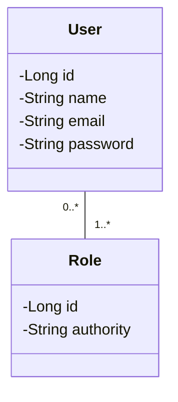

## Checklist: adicionar segurança ao projeto

## 1. Modelo de domínio User-Role



## 2. Dependências

```
<dependency>
	<groupId>org.springframework.boot</groupId>
	<artifactId>spring-boot-starter-security</artifactId>
</dependency>

<dependency>
	<groupId>org.springframework.security</groupId>
	<artifactId>spring-security-test</artifactId>
	<scope>test</scope>
</dependency>

<dependency>
	<groupId>org.springframework.security</groupId>
	<artifactId>spring-security-oauth2-authorization-server</artifactId>
</dependency>

<dependency>
	<groupId>org.springframework.boot</groupId>
	<artifactId>spring-boot-starter-oauth2-resource-server</artifactId>
</dependency>
```

## 3. Checklist Spring security

* GrantedAuthority
* UserDetails
* UserDetailsService
* UsernameNotFoundException


## 4. Valores de configuração

```
security.client-id=${CLIENT_ID:myclientid}
security.client-secret=${CLIENT_SECRET:myclientsecret}

security.jwt.duration=${JWT_DURATION:86400}

cors.origins=${CORS_ORIGINS:http://localhost:3000,http://localhost:5173}

```

## 5. Checklist OAuth2 JWT password grant

* Implementação customizada do password grant
* Authorization server
* Resource server

## 6. Fazer o controle de acesso por perfil e rota

```
@PreAuthorize("hasRole('ROLE_ADMIN')")
@PreAuthorize("hasAnyRole('ROLE_ADMIN', 'ROLE_OPERATOR')")
```

## 7. Obtendo o usuário logado

```
Authentication authentication = SecurityContextHolder.getContext().getAuthentication();
Jwt jwtPrincipal = (Jwt) authentication.getPrincipal();
String username = jwtPrincipal.getClaim("username");
```

